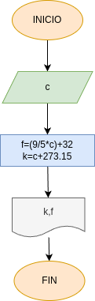

# Convertir graddos celsius 
programa en python para poder pasar de grados celsius a grados kelvin y farenheit

## funcionamiento 
- ingrese un valor el cual no tiene limite alguno, numero en el cual se pueden incluir decimales 
- el programa se encarga de hacer automaticamente los procesos necesarios para entregar como un producto final la temperatura en, farenheit y kelvin
## Diagrama de flujo
